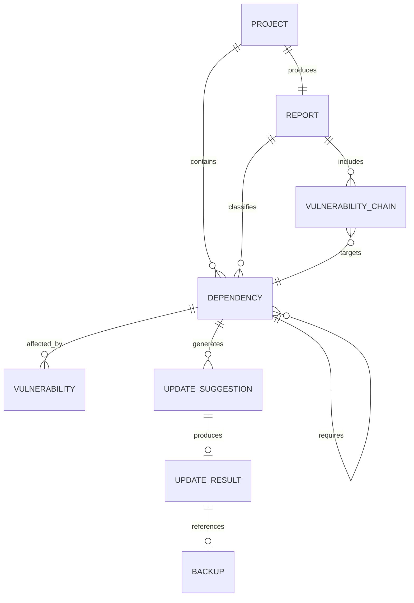

**UNIVERSIDAD PRIVADA DE TACNA**

**FACULTAD DE INGENIERÍA**

**Escuela Profesional de Ingeniería de Sistemas**

**Diccionario de Datos**

**Sistema Analizador de Dependencias Multi-Lenguaje (DepAnalyzer)**

Curso: *Calidad y Pruebas de Software*

Docente: *Patrick Cuadros Quiroga*

Integrantes:

***Carbajal Vargas, Andre Alejandro (2023077287)***

***Yupa Gómez, Fátima Sofía (2023076618)***

**Tacna - Perú**

***2026***

\pagebreak

Sistema *Analizador de Dependencias Multi-Lenguaje (DepAnalyzer)*

Diccionario de Datos

Versión *1.0*

| CONTROL DE VERSIONES |           |              |               |            |                                      |
|:--------------------:|:----------|:-------------|:--------------|:-----------|:-------------------------------------|
|       Versión        | Hecha por | Revisada por | Aprobada por  | Fecha      | Motivo                               |
|         1.0          | ACV, FYG  | ACV, FYG     | P. Cuadros Q. | 2026-06-23 | Versión inicial del diccionario      |

# ÍNDICE GENERAL

1. [Introducción](#1-introducción)
2. [Convenciones del Modelo](#2-convenciones-del-modelo)
3. [Entidades del Dominio](#3-entidades-del-dominio)
4. [Detalle de Estructuras](#4-detalle-de-estructuras)
5. [Catálogos y Enumeraciones](#5-catálogos-y-enumeraciones)
6. [Relaciones entre Entidades](#6-relaciones-entre-entidades)
7. [Reglas de Calidad de Datos](#7-reglas-de-calidad-de-datos)
8. [Seguridad, Privacidad y Persistencia](#8-seguridad-privacidad-y-persistencia)
9. [Trazabilidad Técnica](#9-trazabilidad-técnica)
10. [Glosario](#10-glosario)

\pagebreak

# 1. Introducción

## 1.1 Propósito

Este documento define los datos que utiliza DepAnalyzer para detectar proyectos, interpretar dependencias, consultar
versiones y vulnerabilidades, construir grafos, generar reportes y proponer actualizaciones. Su propósito es proporcionar
un vocabulario común entre requerimientos, arquitectura, implementación, pruebas y documentación.

## 1.2 Alcance

El diccionario cubre los modelos en memoria, valores de configuración, estructuras de reporte y datos temporales
generados durante el análisis. DepAnalyzer no utiliza una base de datos relacional permanente; por ello, las entidades
descritas corresponden principalmente a objetos Kotlin, documentos JSON, archivos de construcción y respuestas de APIs.

## 1.3 Fuentes de Datos

| Fuente | Datos obtenidos | Ejemplos |
|--------|-----------------|----------|
| Manifiestos de proyecto | Dependencias declaradas, secciones y repositorios | `pom.xml`, `build.gradle`, `package.json` |
| Lockfiles | Versiones resueltas y relaciones transitivas | `package-lock.json`, `poetry.lock` |
| Herramientas de build | Árbol real de dependencias | Maven y Gradle |
| Repositorios de paquetes | Metadatos y versiones disponibles | Maven Central y repositorios configurados |
| Fuentes SCA | Vulnerabilidades, CVE, CVSS y referencias | OSS Index y NVD |
| Configuración de ejecución | Tokens, flags, modos y timeouts | Variables de entorno y opciones CLI |

# 2. Convenciones del Modelo

- Los nombres de tipos Kotlin se expresan en `PascalCase`.
- Los atributos se expresan en `camelCase`.
- Los identificadores de catálogo se representan en `UPPER_SNAKE_CASE`.
- Los campos no disponibles se mantienen como nulos o valores explícitos como `unknown`, según el contrato del modelo.
- Las rutas deben interpretarse respecto del proyecto analizado, salvo que se indique que son absolutas.
- Las fechas y horas intercambiadas como texto deben emplear ISO 8601.
- Los puntajes CVSS se representan como números decimales entre 0.0 y 10.0.
- Las coordenadas de paquetes deben conservar el ecosistema para evitar colisiones entre Maven, npm y PyPI.

# 3. Entidades del Dominio

| Entidad | Descripción | Origen | Atributos principales |
|---------|-------------|--------|-----------------------|
| Proyecto detectado | Proyecto analizado por la aplicación | `ProjectDetector` | `path`, `projectType`, `buildFile`, `ecosystem` |
| Dependencia parseada | Componente declarado o resuelto | Parsers por ecosistema | `group`, `name`, `version`, `section`, `sourceLocation` |
| Repositorio | Fuente remota de metadatos | Manifiesto o valor predeterminado | `id`, `url`, `credentials`, `trustedHost` |
| Vulnerabilidad | Hallazgo asociado a un componente | OSS Index o NVD | `id`, `title`, `description`, `cvssScore`, `severity`, `source` |
| Reporte | Resultado consolidado del análisis | `ProjectAnalyzer` | `upToDate`, `outdated`, `directVulnerable`, `transitiveVulnerable` |
| Nodo de dependencia | Componente dentro del grafo | Resolución estática o dinámica | `coordinate`, `children`, `direct`, `depth` |
| Cadena vulnerable | Ruta hacia un componente vulnerable | `core.graph` | `root`, `path`, `target`, `classification` |
| Sugerencia de actualización | Cambio recomendado | `UpdatePlanner` | `id`, `currentVersion`, `targetVersion`, `reason`, `targetType` |
| Resultado de actualización | Estado de una aplicación o simulación | `BuildFileUpdater` | `suggestion`, `applied`, `note`, `backupPath` |
| Evento de telemetría | Registro anónimo de uso | `TelemetryClient` | `eventType`, `feature`, `durationMs`, `errorType` |

# 4. Detalle de Estructuras

## 4.1 Proyecto Detectado

| Campo | Tipo lógico | Obligatorio | Descripción / Regla |
|-------|-------------|:-----------:|---------------------|
| `path` | Ruta | Sí | Directorio raíz recibido por CLI |
| `projectType` | Catálogo | Sí | Tipo de manifiesto detectado |
| `buildFile` | Ruta | Sí | Archivo principal de dependencias |
| `ecosystem` | Catálogo | Sí | Ecosistema normalizado |
| `lockFile` | Ruta | No | Lockfile asociado cuando existe |

## 4.2 Dependencia

| Campo | Tipo lógico | Obligatorio | Descripción / Regla |
|-------|-------------|:-----------:|---------------------|
| `group` | Texto | Condicional | Grupo Maven; no aplica a todos los ecosistemas |
| `name` | Texto | Sí | Nombre o artifact de la dependencia |
| `version` | Texto | No | Versión declarada o resuelta |
| `ecosystem` | Catálogo | Sí | Maven, npm o PyPI |
| `section` | Catálogo | Sí | Sección de procedencia |
| `direct` | Booleano | Sí | Indica si fue declarada directamente |
| `sourceLocation` | Objeto | No | Archivo, línea o clave de origen |
| `purl` | Texto | No | Identificador Package URL normalizado |

La identidad lógica se obtiene combinando ecosistema y coordenada. En Maven se utiliza
`group:artifact:version`; en npm y PyPI se utiliza `name:version`, conservando siempre el ecosistema.

## 4.3 Vulnerabilidad

| Campo | Tipo lógico | Obligatorio | Descripción / Regla |
|-------|-------------|:-----------:|---------------------|
| `id` | Texto | Sí | Identificador CVE o identificador de la fuente |
| `title` | Texto | No | Nombre resumido del hallazgo |
| `description` | Texto | No | Explicación proporcionada por la fuente |
| `cvssScore` | Decimal | No | Puntaje entre 0.0 y 10.0 |
| `severity` | Catálogo | Sí | Severidad normalizada |
| `reference` | URL | No | Referencia técnica externa |
| `source` | Catálogo | Sí | Procedencia del hallazgo |
| `affectedDependency` | Referencia | Sí | Dependencia relacionada |

## 4.4 Reporte de Dependencias

| Campo | Tipo lógico | Descripción |
|-------|-------------|-------------|
| `projectName` | Texto | Nombre del proyecto analizado |
| `upToDate` | Lista | Dependencias sin actualización detectada |
| `outdated` | Lista | Dependencias con versión reciente disponible |
| `directVulnerable` | Lista | Dependencias directas con hallazgos |
| `transitiveVulnerable` | Lista | Dependencias transitivas con hallazgos |
| `dependencyTree` | Árbol | Representación jerárquica de componentes |
| `warnings` | Lista de texto | Errores parciales o limitaciones del análisis |

## 4.5 Grafo y Cadena Vulnerable

| Campo | Tipo lógico | Descripción |
|-------|-------------|-------------|
| `coordinate` | Texto | Identificador normalizado del nodo |
| `children` | Lista de nodos | Dependencias requeridas por el nodo |
| `isDirectDependency` | Booleano | Indica relación directa con el proyecto |
| `depth` | Entero | Profundidad respecto de la raíz |
| `path` | Lista de coordenadas | Ruta desde la dependencia directa al objetivo |
| `classification` | Catálogo | Clasificación directa o transitiva |

## 4.6 Sugerencia y Resultado de Actualización

| Campo | Tipo lógico | Descripción |
|-------|-------------|-------------|
| `id` | Texto | Identificador estable de la sugerencia |
| `dependency` | Referencia | Dependencia que se propone modificar |
| `currentVersion` | Texto | Versión encontrada |
| `targetVersion` | Texto | Versión recomendada |
| `targetType` | Catálogo | Tipo de archivo o ubicación modificable |
| `reason` | Catálogo | Seguridad, actualización o ambos |
| `applied` | Booleano | Indica si el cambio fue escrito |
| `backupPath` | Ruta | Respaldo creado antes de modificar |
| `note` | Texto | Resultado, advertencia o causa de omisión |

## 4.7 Evento de Telemetría

| Campo | Tipo lógico | Regla de privacidad |
|-------|-------------|---------------------|
| `eventType` | Catálogo | Describe la operación, no al usuario |
| `feature` | Texto controlado | Nombre de la función utilizada |
| `durationMs` | Entero largo | Duración sin contenido del proyecto |
| `errorType` | Texto controlado | Categoría del error sin mensaje sensible |

No se deben incluir rutas personales, nombres de proyectos, contenido de archivos, tokens ni coordenadas privadas.

# 5. Catálogos y Enumeraciones

| Catálogo | Valores principales | Uso |
|----------|---------------------|-----|
| Tipo de proyecto | `MAVEN`, `GRADLE_GROOVY`, `GRADLE_KOTLIN`, `NPM`, `PYTHON_POETRY`, `PYTHON_REQUIREMENTS` | Selección de parser y updater |
| Ecosistema | `MAVEN`, `NPM`, `PYPI` | Normalización y consulta de fuentes |
| Sección | `DEPENDENCIES`, `DEPENDENCY_MANAGEMENT`, `DEV`, `TEST`, `RUNTIME` | Procedencia funcional |
| Severidad | `LOW`, `MEDIUM`, `HIGH`, `CRITICAL`, `UNKNOWN` | Priorización de vulnerabilidades |
| Fuente | `OSS_INDEX`, `NVD` | Trazabilidad del hallazgo |
| Modo de fuente | `AUTO`, `OSS_ONLY`, `NVD_ONLY` | Política de consulta |
| Clasificación | `DIRECT`, `TRANSITIVE` | Relación con el proyecto |
| Expansión de árbol | `collapsed`, `critical`, `high`, `medium`, `all` | Presentación visual |
| Razón de actualización | Seguridad, versión disponible o combinación | Explicación de sugerencias |
| Formato de salida | `console`, `json` | Representación del reporte |

# 6. Relaciones entre Entidades

La relación recursiva entre dependencias representa el grafo transitivo. Un reporte puede contener el mismo componente en
diferentes vistas, pero debe evitar duplicar hallazgos equivalentes dentro de una misma clasificación.

# 7. Reglas de Calidad de Datos

1. Toda dependencia debe conservar su ecosistema y una coordenada identificable.
2. Una versión no resuelta debe registrarse como ausencia conocida y no provocar la pérdida del resto del reporte.
3. Los valores de severidad deben normalizarse antes de ordenar o filtrar hallazgos.
4. Las listas JSON deben serializarse como arreglos vacíos cuando no existan resultados, no como texto descriptivo.
5. Los errores de una fuente externa deben conservarse como advertencias sin inventar vulnerabilidades.
6. Las URLs de repositorios deben validarse antes de utilizar credenciales.
7. Una cadena vulnerable debe comenzar en una dependencia directa y terminar en el componente afectado.
8. Las sugerencias de actualización deben incluir versión actual, versión objetivo y razón.
9. Un resultado aplicado debe referenciar el respaldo creado o explicar por qué no fue necesario.
10. Los nombres de campos públicos del JSON deben permanecer estables o versionarse cuando exista un cambio incompatible.

# 8. Seguridad, Privacidad y Persistencia

DepAnalyzer procesa la mayoría de datos en memoria. Los archivos persistentes se limitan a reportes solicitados,
respaldos de actualización, artefactos de pruebas y documentación. Los tokens se leen durante la ejecución y no forman
parte del modelo de reporte.

- Las credenciales solo se envían por HTTPS a hosts incluidos en `DEPANALYZER_TRUSTED_CREDENTIAL_HOSTS`.
- Los reportes no deben contener tokens, contraseñas ni cabeceras de autenticación.
- La telemetría es anónima, puede desactivarse y no debe incluir contenido del proyecto.
- Los backups deben ubicarse junto al archivo modificado o en la ruta definida por el actualizador.
- Los datos obtenidos desde APIs externas se consideran no confiables y deben validarse antes de mostrarse o serializarse.

# 9. Trazabilidad Técnica

| Entidad | Implementación principal |
|---------|--------------------------|
| Proyecto | `parser/ProjectDetector.kt`, `parser/ProjectType.kt` |
| Dependencia | `parser/ParsedDependency.kt` |
| Reporte | `report/DependencyReport.kt` |
| Vulnerabilidad | `report/Vulnerability.kt` |
| Grafo | `core/graph/DependencyGraph.kt`, `DependencyNode.kt` |
| Cadena | `core/graph/VulnerabilityChain.kt` |
| Actualización | `update/UpdateModels.kt`, `UpdatePlanner.kt` |
| Telemetría | `telemetry/TelemetryEvent.kt` |

# 10. Glosario

| Término | Definición |
|---------|------------|
| Coordenada | Identificador compuesto de una dependencia dentro de su ecosistema |
| PURL | Formato estándar para identificar paquetes |
| Manifiesto | Archivo que declara dependencias y configuración del proyecto |
| Lockfile | Archivo con versiones resueltas para instalaciones reproducibles |
| CVE | Identificador público de vulnerabilidad |
| CVSS | Sistema de puntuación de severidad |
| Directa | Dependencia declarada explícitamente |
| Transitiva | Dependencia incorporada por otra dependencia |
