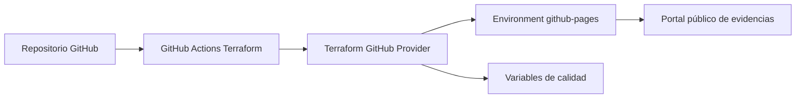

<center>


**UNIVERSIDAD PRIVADA DE TACNA**

**FACULTAD DE INGENIERÍA**

**Escuela Profesional de Ingeniería de Sistemas**

**Informe de Factibilidad**

**Sistema Analizador de Dependencias Multi-Lenguaje (DepAnalyzer)**

Curso: *Calidad y Pruebas de Software*

Docente: *Patrick Cuadros Quiroga*

Integrantes:

***Carbajal Vargas, Andre Alejandro (2023077287)***

***Yupa Gómez, Fátima Sofía (2023076618)***

**Tacna - Perú**

***2026***

</center>

<div style="page-break-after: always; visibility: hidden">\pagebreak</div>

Sistema *Analizador de Dependencias Multi-Lenguaje (DepAnalyzer)*

Informe de Factibilidad

Versión *1.2*

| CONTROL DE VERSIONES |           |              |               |            |                                                |
|:--------------------:|:----------|:-------------|:--------------|:-----------|:-----------------------------------------------|
|       Versión        | Hecha por | Revisada por | Aprobada por  | Fecha      | Motivo                                         |
|         1.0          | ACV, FYG  | ACV, FYG     | P. Cuadros Q. | 2026-01-01 | Versión original                               |
|         1.1          | ACV, FYG  | ACV, FYG     | P. Cuadros Q. | 2026-01-15 | Corrección de formato y actualización de datos |
|         1.2          | ACV, FYG  | ACV, FYG     | P. Cuadros Q. | 2026-06-23 | Unificación del formato institucional          |

# ÍNDICE GENERAL

1. [Descripción del Proyecto](#1-descripción-del-proyecto)
2. [Riesgos](#2-riesgos)
3. [Análisis de la Situación Actual](#3-análisis-de-la-situación-actual)
4. [Estudio de Factibilidad](#4-estudio-de-factibilidad)
    - 4.1 [Factibilidad Técnica](#41-factibilidad-técnica)
    - 4.2 [Factibilidad Económica](#42-factibilidad-económica)
    - 4.3 [Factibilidad Operativa](#43-factibilidad-operativa)
    - 4.4 [Factibilidad Legal](#44-factibilidad-legal)
    - 4.5 [Factibilidad Social](#45-factibilidad-social)
    - 4.6 [Factibilidad Ambiental](#46-factibilidad-ambiental)
5. [Análisis Financiero](#5-análisis-financiero)
6. [Conclusiones](#6-conclusiones)

<div style="page-break-after: always; visibility: hidden">\pagebreak</div>

# Informe de Factibilidad

## 1. Descripción del Proyecto

### 1.1. Nombre del proyecto

**Analizador de Dependencias Multi-Lenguaje — DepAnalyzer**

### 1.2. Duración del proyecto

El proyecto tiene una duración estimada de aproximadamente **4 semanas** (≈26 días), distribuidas entre el desarrollo
del núcleo funcional, las interfaces de distribución, la cobertura de pruebas y la documentación técnica.

| Fase                               | Sprints      | Duración  |
|------------------------------------|--------------|-----------|
| Core: Parsers y repositorios       | Sprint 1 – 2 | 2 dias    |
| Core: CVEs y árbol transitivo      | Sprint 3 – 4 | 2 semanas |
| CLI interactiva y TUI              | Sprint 5 – 6 | 3 dias    |
| CI/CD, pruebas e2e y documentación | Sprint 7 – 8 | 1 semana  |

### 1.3. Descripción

DepAnalyzer es una herramienta de código abierto desarrollada en **Kotlin** con **Gradle (Kotlin DSL)** cuyo
propósito es ayudar a los equipos de desarrollo Java a mantener sus proyectos seguros y actualizados. La herramienta
analiza los archivos de configuración de dependencias (Maven `pom.xml`, Gradle Groovy DSL `build.gradle` y Gradle Kotlin
DSL `build.gradle.kts`), detecta dependencias con versiones desactualizadas y vulnerabilidades de seguridad conocidas (
CVEs), y ofrece al usuario la posibilidad de aplicar actualizaciones de forma controlada y confirmada.

La importancia del proyecto radica en que la gestión manual de dependencias es una de las principales causas de deuda
técnica y brechas de seguridad en proyectos Maven, Gradle, npm y Python. Según informes del sector, más del 80% de los proyectos open-source
contienen al menos una dependencia con vulnerabilidad conocida. DepAnalyzer cubre una necesidad real en el
ecosistema Java al integrar en una sola herramienta el análisis de versiones, la consulta de bases de datos de CVEs y la
resolución del árbol de dependencias transitivas, algo que las herramientas existentes abordan de forma separada o
incompleta.

El proyecto se enmarca como trabajo de tesis en la Escuela Profesional de Ingeniería de Sistemas de la Universidad
Privada de Tacna.

### 1.4. Objetivos

#### 1.4.1. Objetivo general

Desarrollar una herramienta de análisis de dependencias para proyectos Maven, Gradle, npm y Python que detecte versiones desactualizadas y
vulnerabilidades de seguridad (CVEs) en dependencias directas y transitivas, y que permita aplicar actualizaciones de
manera controlada e interactiva, distribuible como CLI, interfaz TUI y pipeline CI/CD.

#### 1.4.2. Objetivos específicos

1. **Implementar parsers multi-formato** para leer y extraer dependencias de archivos `pom.xml`, `build.gradle` (Groovy
   DSL) y `build.gradle.kts` (Kotlin DSL), incluyendo resolución de variables de versión y catálogos de versiones (
   libs.versions.toml), con el fin de soportar los gestores de dependencias más utilizados en el ecosistema Java.

2. **Desarrollar un motor de resolución de repositorios** que lea los repositorios declarados en el propio proyecto
   analizado (Maven Central, Nexus privado, JitPack, Google Maven, Artifactory, etc.) para consultar las versiones más
   recientes de cada dependencia, respetando la configuración real del equipo en lugar de asumir una fuente fija.

3. **Integrar fuentes de inteligencia de seguridad** (OSS Index de Sonatype como fuente primaria y NVD del NIST como
   fuente secundaria) para detectar vulnerabilidades conocidas y clasificarlas por severidad (Critical, High, Medium,
   Low) según el estándar CVSS, logrando así una cobertura amplia y actualizada de CVEs.

4. **Construir un analizador de árbol de dependencias transitivas** mediante la integración con `mvn dependency:tree` y
   el Gradle Tooling API, de modo que el análisis de CVEs y versiones abarque no solo las dependencias directas sino
   también todas las dependencias transitivas del proyecto.

5. **Implementar un modo interactivo de actualización** que presente al usuario las sugerencias de cambio (versión
   actual → versión nueva + razón) y exija confirmación explícita antes de modificar cualquier archivo de build,
   garantizando que la herramienta nunca realice cambios destructivos de forma automática.

6. **Distribuir la herramienta como CLI, interfaz TUI y pipeline CI/CD**, incluyendo una GitHub Action reutilizable, una
   imagen Docker y una interfaz de terminal interactiva construida con Mordant, para que pueda integrarse en flujos de
   trabajo individuales y de equipos.

## 2. Riesgos

| #  | Riesgo                                                                                                                                                                                         | Probabilidad | Impacto | Mitigación                                                                                                                                                                     |
|----|------------------------------------------------------------------------------------------------------------------------------------------------------------------------------------------------|:------------:|:-------:|--------------------------------------------------------------------------------------------------------------------------------------------------------------------------------|
| R1 | **Cambios en las APIs externas** (OSS Index, NVD): modificaciones en los endpoints o esquemas de respuesta pueden romper la integración de seguridad.                                          |    Media     |  Alto   | Abstracción detrás de interfaces internas; tests con mocks independientes de la API real; versionar el cliente HTTP.                                                           |
| R2 | **Rate limiting de las APIs gratuitas**: OSS Index y NVD imponen cuotas de peticiones que pueden bloquear el análisis de proyectos grandes.                                                    |     Alta     |  Medio  | Implementar caché local de resultados, backoff exponencial ante errores 429 y soporte opcional de API keys.                                                                    |
| R3 | **Complejidad del árbol transitivo de Gradle**: el Gradle Tooling API requiere que Gradle esté instalado en el sistema analizado, lo que puede no cumplirse en todos los entornos.             |    Media     |  Alto   | Detección previa de la disponibilidad de Gradle; fallback a análisis solo de dependencias directas con advertencia explícita al usuario.                                       |
| R4 | **Diversidad de formatos de archivos de build**: proyectos con configuraciones no estándar, builds multi-módulo complejos o uso de plugins propietarios pueden no ser parseados correctamente. |     Alta     |  Medio  | Suite de tests con proyectos reales de referencia (Spring Boot, Quarkus, Micronaut); manejo de errores con mensajes descriptivos.                                              |
| R5 | **Repositorios privados inaccesibles**: proyectos que apuntan a Nexus o Artifactory privados sin credenciales disponibles harán fallar la consulta de versiones.                               |    Media     |  Bajo   | Soporte de credenciales via variables de entorno; fallback a Maven Central con advertencia; modo `--skip-version-check` para análisis solo de CVEs.                            |
| R6 | **Escritura incorrecta en archivos de build**: un error en el módulo de actualización podría corromper el archivo de build del proyecto analizado.                                             |     Baja     |  Alto   | Creación obligatoria de backup (`.bak`) antes de cualquier modificación; opción `--dry-run` para previsualizar cambios; suite de tests del módulo updater con archivos reales. |
| R7 | **Alcance del plugin IntelliJ** potencialmente subestimado para el período de tesis.                                                                                                           |     Alta     |  Bajo   | El plugin IntelliJ está explícitamente diferido como trabajo post-tesis; no impacta el entregable principal.                                                                   |

## 3. Análisis de la Situación Actual

### 3.1. Planteamiento del problema

El ecosistema Java es uno de los más maduros y ampliamente utilizados en el desarrollo de software empresarial. Los
proyectos modernos dependen de docenas o incluso cientos de bibliotecas de terceros gestionadas mediante
herramientas como Apache Maven y Gradle. Esta dependencia masiva de código externo introduce dos problemas críticos que
los equipos de desarrollo enfrentan de forma recurrente:

**Deuda técnica por versiones desactualizadas.** Las dependencias de un proyecto Java evolucionan continuamente: se
publican nuevas versiones con mejoras de rendimiento, correcciones de bugs y nuevas funcionalidades. Sin embargo,
actualizar dependencias manualmente requiere revisar cada una en su repositorio correspondiente, evaluar si la
actualización es compatible (breaking changes) y modificar el archivo de build. Este proceso es tedioso y propenso a ser
omitido, acumulando deuda técnica.

**Vulnerabilidades de seguridad no detectadas.** Las bases de datos públicas de CVEs (Common Vulnerabilities and
Exposures), como la gestionada por el NIST, registran miles de vulnerabilidades en bibliotecas de software ampliamente
utilizadas. Un proyecto Java puede tener una dependencia directa aparentemente actualizada pero que internamente
introduce una dependencia transitiva con un CVE crítico conocido. Sin herramientas especializadas, estas
vulnerabilidades pasan desapercibidas hasta que son explotadas.

**Soluciones existentes y sus limitaciones.** Herramientas como OWASP Dependency-Check, Dependabot o Snyk abordan
parcialmente estos problemas, pero presentan limitaciones importantes: Dependabot requiere integración con GitHub y
opera en la nube; OWASP Dependency-Check genera reportes estáticos sin capacidad de actualización; Snyk es una solución
SaaS de pago para funcionalidades avanzadas. Ninguna de estas herramientas ofrece simultáneamente análisis local
offline, respeto por los repositorios privados del proyecto, resolución de árbol transitivo con Gradle Tooling API y un
modo interactivo de actualización en terminal.

DepAnalyzer busca cubrir este nicho: una herramienta de código abierto, ejecutable localmente, que respeta la
configuración real del proyecto (repositorios privados incluidos) y que guía al desarrollador en el proceso de
actualización de forma segura e interactiva.

### 3.2. Consideraciones de hardware y software

**Hardware disponible para el desarrollo:**

| Recurso                   | Especificación mínima                                  | Disponibilidad                        |
|---------------------------|--------------------------------------------------------|---------------------------------------|
| Computadora de desarrollo | CPU 4 núcleos, 8 GB RAM, 50 GB almacenamiento          | Disponible (equipo del desarrollador) |
| Servidor de CI/CD         | GitHub Actions (runners gratuitos para repos públicos) | Disponible (plan gratuito de GitHub)  |

**Software requerido:**

| Software                           | Versión | Propósito                                    | Licencia                     |
|------------------------------------|---------|----------------------------------------------|------------------------------|
| JDK (GraalVM / Temurin compatible) | 25+     | Plataforma de ejecución y compilación nativa | GPL v2 + Classpath Exception |
| Kotlin                             | 2.3.10  | Lenguaje de desarrollo                       | Apache 2.0                   |
| Gradle                             | 8.x     | Build system y Tooling API                   | Apache 2.0                   |
| IntelliJ IDEA Community            | 2024.x  | IDE de desarrollo                            | Apache 2.0                   |
| Git                                | 2.x     | Control de versiones                         | GPL v2                       |
| Docker                             | 26.x    | Empaquetado y distribución                   | Apache 2.0                   |
| GitHub (repositorio)               | —       | Gestión del proyecto y CI/CD                 | Gratuito (plan public)       |

**APIs externas consumidas:**

| API                   | Proveedor | Plan     | Limitaciones                                   |
|-----------------------|-----------|----------|------------------------------------------------|
| OSS Index API         | Sonatype  | Gratuito | 128 componentes/request; rate limiting         |
| NVD REST API          | NIST      | Gratuito | ~50 req/h sin API key; ~200+ req/h con API key |
| Maven Central (repos) | Apache    | Gratuito | Sin restricciones relevantes                   |

## 4. Estudio de Factibilidad

El estudio de factibilidad fue preparado para evaluar la viabilidad del proyecto desde las dimensiones técnica,
económica, operativa, legal, social y ambiental. El resultado del estudio determina si el proyecto puede ejecutarse con
los recursos disponibles y si sus beneficios justifican la inversión.

### 4.1. Factibilidad Técnica

El proyecto es técnicamente factible. Todos los componentes tecnológicos requeridos son de código abierto, ampliamente
documentados y con soporte activo de la comunidad.

**Lenguaje y plataforma.** Kotlin sobre JVM es una opción sólida para este tipo de herramientas: ofrece
interoperabilidad total con bibliotecas Java existentes (como `maven-model` para parsear POM), tipado estático que
reduce errores en tiempo de ejecución y soporte nativo en Gradle (Kotlin DSL). El proyecto mantiene como línea base *
*JDK 25+** por su configuración actual de toolchain y compilación nativa.

**Parseo de archivos de build.** Para Maven se utiliza la biblioteca `maven-model` (parte del propio proyecto Apache
Maven), que proporciona un parser robusto y probado en producción para `pom.xml`. Para archivos Gradle, dado que no
existe una biblioteca oficial de parseo de DSL Gradle para uso externo, se implementará un parser basado en expresiones
regulares y análisis léxico básico, suficiente para los patrones de declaración de dependencias más comunes.

**Resolución de árbol transitivo.** Para Maven se invoca `mvn dependency:tree` como proceso externo, técnica estándar y
documentada. Para Gradle se utiliza el Gradle Tooling API, una API oficial de Gradle diseñada específicamente para que
herramientas externas (como IDEs) consulten el modelo de un proyecto Gradle sin necesidad de ejecutar tareas.

**Integración con APIs de seguridad.** La API de OSS Index de Sonatype es pública, con documentación oficial y SDK de
referencia. La API de NVD del NIST es un servicio del gobierno de los Estados Unidos, estable y con versión 2.0
publicada en 2023. Ambas están disponibles sin contrato y son utilizadas por proyectos open-source de referencia.

**Distribución.** La distribución como fat JAR (ejecutable), imagen Docker y GitHub Action son tecnologías maduras con
amplia documentación. El plugin de Gradle `shadow` permite generar el fat JAR. GitHub Actions y Docker Hub proveen la
infraestructura de distribución de forma gratuita para proyectos open-source.

**Evaluación:** No se requiere inversión en infraestructura adicional. El equipo de cómputo disponible es suficiente
para el desarrollo y las pruebas. **La factibilidad técnica es ALTA.**

### 4.2. Factibilidad Económica

El proyecto es de naturaleza académica y open-source. No contempla ingresos ni retorno financiero directo por tratarse
de un trabajo formativo; sin embargo, sí presenta costos reales de ejecución (internet y energía eléctrica). La
dedicación horaria del equipo existe, pero no se monetiza por no tratarse de trabajo remunerado. Por ello, la
factibilidad económica se evalúa en función de si los costos operativos son asumibles dentro del contexto académico.

#### 4.2.1. Costos Generales

No se registran gastos significativos en materiales físicos o impresiones durante el desarrollo del proyecto.

#### 4.2.2. Costos Operativos Durante el Desarrollo

| Ítem                                                           | Cantidad (meses) | Costo Mensual (S/.) | Costo Total (S/.) |
|----------------------------------------------------------------|:----------------:|:-------------------:|:-----------------:|
| Servicio de internet (parte proporcional del costo doméstico)  |        1         |        40.00        |       40.00       |
| Energía eléctrica (consumo del equipo de desarrollo, estimado) |        1         |        25.00        |       25.00       |
| **Total Costos Operativos**                                    |                  |                     |     **65.00**     |

#### 4.2.3. Costos del Ambiente

| Ítem                                                             | Costo (S/.) |
|------------------------------------------------------------------|:-----------:|
| GitHub (plan gratuito para repositorios públicos)                |    0.00     |
| Docker Hub (plan gratuito para imágenes públicas)                |    0.00     |
| GitHub Actions (plan gratuito: 2000 min/mes para repos públicos) |    0.00     |
| APIs de OSS Index y NVD (plan gratuito)                          |    0.00     |
| Dominio para documentación (GitHub Pages — gratuito)             |    0.00     |
| IntelliJ IDEA Community Edition (licencia gratuita)              |    0.00     |
| JDK Eclipse Temurin (licencia gratuita)                          |    0.00     |
| Gemini Pro (plan estudiantil disponible)                         |    0.00     |
| Claude (plan gratuito)                                           |    0.00     |
| **Total Costos del Ambiente**                                    |  **0.00**   |

#### 4.2.4. Costos de Personal

El trabajo del equipo se realiza como parte de la formación académica y no contempla remuneración económica.

#### 4.2.5. Costos Totales del Desarrollo del Sistema

| Categoría                               | Costo (S/.) |
|-----------------------------------------|:-----------:|
| Costos Generales                        |    0.00     |
| Costos Operativos durante el desarrollo |    65.00    |
| Costos del Ambiente                     |    0.00     |
| Costos de Personal                      |    0.00     |
| **TOTAL**                               |  **65.00**  |

### 4.3. Factibilidad Operativa

**Beneficios para los usuarios finales.** DepAnalyzer está orientado a desarrolladores individuales y equipos
de desarrollo que gestionen proyectos con Maven o Gradle. La herramienta reduce significativamente el tiempo invertido
en la revisión manual de dependencias y elimina la posibilidad de pasar por alto vulnerabilidades en dependencias
transitivas, algo que no es humanamente viable de forma manual en proyectos con decenas de dependencias y árboles
transitivos de cientos de nodos.

**Capacidad de mantenimiento.** Al ser un proyecto de código abierto publicado en GitHub, la herramienta puede recibir
contribuciones de la comunidad tras su publicación. La arquitectura modular (parsers, repositorios, seguridad, árbol
transitivo, CLI) facilita el mantenimiento independiente de cada componente. La documentación incluye una guía de
contribución (CONTRIBUTING.md) y un sitio de documentación publicado como GitHub Pages.

**Lista de interesados:**

| Interesado                        | Rol                                    | Interés                                                                               |
|-----------------------------------|----------------------------------------|---------------------------------------------------------------------------------------|
| Estudiante autor                  | Desarrollador principal e investigador | Completar la tesis y publicar una herramienta útil                                    |
| Asesor de tesis                   | Supervisor académico                   | Validar la contribución científica y técnica del trabajo                              |
| Comunidad Java open-source        | Usuarios potenciales                   | Disponer de una herramienta gratuita y de código abierto para gestión de dependencias |
| Equipos de desarrollo empresarial | Usuarios potenciales                   | Integrar la herramienta en pipelines CI/CD para cumplimiento de seguridad             |
| Universidad Privada de Tacna      | Institución académica                  | Promover la investigación aplicada y la producción de software de calidad             |

**Evaluación:** El producto es operativamente viable. No requiere personal adicional para su funcionamiento una vez
publicado. **La factibilidad operativa es ALTA.**

### 4.4. Factibilidad Legal

**Licencias de software.** Todo el stack tecnológico del proyecto utiliza licencias permisivas compatibles con la
publicación open-source: Kotlin y Gradle bajo Apache 2.0, JUnit 5 bajo Eclipse Public License 2.0, Clikt y Mordant bajo
Apache 2.0, OkHttp bajo Apache 2.0, Jackson bajo Apache 2.0, maven-model bajo Apache 2.0. No existe conflicto de
licencias para la distribución del proyecto bajo una licencia open-source (Apache 2.0 o MIT).

**Protección de datos.** La herramienta opera localmente sobre los archivos del proyecto analizado. No transmite código
fuente, identificadores de proyecto ni metadatos sensibles a servidores externos, salvo los identificadores de
dependencias (groupId:artifactId:version) que se envían a las APIs de OSS Index y NVD para la consulta de
vulnerabilidades, en línea con el modelo de uso documentado y aceptado de dichas APIs.

**Términos de uso de APIs.** El uso de la API pública de OSS Index está sujeto a los términos de servicio de Sonatype,
que permiten su uso en herramientas open-source. El uso de la API de NVD del NIST es público y sin restricciones de uso
comercial o académico, siendo un servicio gubernamental de acceso abierto.

**Propiedad intelectual.** El software desarrollado constituye una contribución académica original del autor. No
reproduce ni incorpora código de herramientas comerciales existentes.

**Evaluación:** No existen impedimentos legales para el desarrollo, distribución ni uso de la herramienta. **La
factibilidad legal es ALTA.**

### 4.5. Factibilidad Social

El proyecto tiene un impacto social positivo en la comunidad de desarrollo de software. Al ser una herramienta
open-source, cualquier desarrollador o equipo a nivel global puede utilizarla sin costo. Contribuye a elevar la cultura
de seguridad en el desarrollo de software Java, un ecosistema con millones de desarrolladores activos a nivel mundial.

En el contexto local, el proyecto representa un ejemplo de producción de software con impacto real durante la formación
universitaria, lo que puede servir como referente para futuros estudiantes de Ingeniería de Sistemas. La publicación en
GitHub como repositorio público fomenta las buenas prácticas de colaboración abierta y documentación técnica.

No se identifican impactos negativos de índole social, cultural o ético. La herramienta no recopila datos personales, no
introduce restricciones de acceso y no favorece prácticas discriminatorias de ningún tipo.

**Evaluación:** El proyecto tiene un impacto social positivo y no presenta conflictos éticos. **La factibilidad social
es ALTA.**

### 4.6. Factibilidad Ambiental

El proyecto es una herramienta de software puro, sin componentes físicos de producción ni procesos industriales
asociados. Su impacto ambiental es mínimo:

- **Consumo energético:** el desarrollo se realiza en un equipo de cómputo personal de uso doméstico. El consumo
  adicional atribuible al proyecto es marginal.
- **Infraestructura en la nube:** los servicios de CI/CD (GitHub Actions) y almacenamiento del repositorio utilizan
  infraestructura de proveedores cloud que, según sus reportes de sostenibilidad, operan con objetivos de neutralidad de
  carbono.
- **Distribución digital:** la herramienta se distribuye exclusivamente en formato digital (JAR, imagen Docker, GitHub
  Action), sin componentes físicos que generen residuos.

**Evaluación:** El impacto ambiental del proyecto es despreciable y no presenta conflictos ambientales. **La
factibilidad ambiental es ALTA.**

## 5. Análisis Financiero

### 5.1. Justificación de la Inversión

#### 5.1.1. Beneficios del Proyecto

Dado que DepAnalyzer es una herramienta open-source de uso libre, el retorno de la inversión no se mide en ingresos
económicos directos, sino en beneficios tangibles e intangibles para sus usuarios y para la institución académica.

**Beneficios tangibles:**

| Beneficio                                                                                      | Estimación                                                                             |
|------------------------------------------------------------------------------------------------|----------------------------------------------------------------------------------------|
| Reducción del tiempo de revisión manual de dependencias por proyecto                           | De 4-8 horas a menos de 15 minutos por análisis                                        |
| Detección automática de CVEs que de otro modo requerirían revisión manual de la NVD            | Cobertura del 100% del árbol transitivo vs. 0% en revisión manual                      |
| Eliminación del costo de licencias de herramientas SaaS equivalentes (Snyk, etc.)              | Ahorro de USD 25-50/mes por desarrollador en planes equivalentes                       |
| Integración CI/CD: bloqueo automático de builds con CVEs críticos antes de llegar a producción | Reducción del costo de remediación de vulnerabilidades en producción (factor 10x-100x) |

**Beneficios intangibles:**

- Mejora de la postura de seguridad de los proyectos Maven, Gradle, npm y Python que adopten la herramienta.
- Disponibilidad de una herramienta open-source en español para la comunidad latinoamericana de desarrollo Java.
- Contribución académica y técnica de la Universidad Privada de Tacna al ecosistema open-source.
- Desarrollo de competencias avanzadas del autor en Kotlin, arquitectura de herramientas CLI, integración de APIs de
  seguridad y buenas prácticas de testing.
- Visibilidad del egresado en la comunidad técnica mediante la publicación en GitHub.

#### 5.1.2. Criterios de Inversión

Dado el carácter académico y sin fines de lucro del proyecto, el análisis financiero se realiza desde la perspectiva del
**ahorro generado** para los equipos que adopten la herramienta, comparado con el costo de alternativas de pago. Se
considera como escenario de referencia un equipo de 3 desarrolladores Java utilizando una herramienta SaaS equivalente.

**Parámetros del análisis:**

| Parámetro                                                                | Valor      |
|--------------------------------------------------------------------------|------------|
| Inversión total del proyecto (costo de desarrollo)                       | S/. 65.00  |
| Ahorro mensual estimado (3 devs × S/. 150/mes en licencias equivalentes) | S/. 450.00 |
| Tasa de descuento mensual (COK referencial: 12% anual)                   | 1% mensual |
| Horizonte de evaluación                                                  | 24 meses   |

##### 5.1.2.1. Relación Beneficio/Costo (B/C)

Los beneficios totales a 24 meses (ahorro acumulado) ascienden a S/. 10,800.00 (S/. 450 × 24 meses).

```
B/C = Beneficios Totales / Costo Total de Inversión
B/C = 10,800.00 / 65.00
B/C = 166.15

```

Como el B/C = **166.15 > 1**, el proyecto **se acepta**. Por cada sol invertido en el desarrollo, se generan S/. 166.15
en valor para los equipos que adoptan la herramienta.

##### 5.1.2.2. Valor Actual Neto (VAN)

El VAN se calcula descontando el flujo de beneficios mensuales (S/. 450) a una tasa mensual del 1%, durante 24 meses:

```
VAN = -65.00 + Σ [450 / (1 + 0.01)^t] para t = 1..24
VAN = -65.00 + 450 × [(1 - (1.01)^-24) / 0.01]
VAN = -65.00 + 450 × 21.24
VAN = -65.00 + 9,558.00
VAN = S/. 9,493.00

```

Como el VAN = **S/. 9,493.00 > 0**, el proyecto **se acepta**.

##### 5.1.2.3. Tasa Interna de Retorno (TIR)

La TIR es la tasa a la que el VAN = 0:

```
0 = -65.00 + 450 × [(1 - (1 + TIR)^-24) / TIR]
```

Con una inversión inicial muy baja frente al flujo mensual de beneficios estimados, la TIR resultante es
extraordinariamente alta y pierde valor interpretativo práctico. Por ello, para este caso se prioriza la evaluación con
B/C y VAN, ambos claramente favorables.

**Resumen del análisis financiero:**

| Indicador    |               Resultado                |  Decisión   |
|--------------|:--------------------------------------:|:-----------:|
| Relación B/C |                 166.15                 |  Aceptado   |
| VAN          |              S/. 9,493.00              |  Aceptado   |
| TIR          | No representativa por inversión mínima | Referencial |

## 6. Conclusiones

El análisis de factibilidad realizado sobre el proyecto **DepAnalyzer — Analizador de Dependencias Multi-Lenguaje** arroja
resultados positivos en todas las dimensiones evaluadas:

1. **Factibilidad Técnica:** El proyecto es técnicamente viable. Todo el stack tecnológico (Kotlin, Gradle Tooling API,
   OSS Index, NVD, Docker) es maduro, open-source y ampliamente documentado. No se requiere inversión en infraestructura
   adicional más allá del equipo de cómputo disponible.

2. **Factibilidad Económica:** El costo total del proyecto asciende a S/. 65.00, correspondiente a costos operativos
   básicos (internet y energía). No existe costo de personal remunerado, ya que el trabajo se realiza como parte de la
   formación académica.

3. **Factibilidad Operativa:** La herramienta cubre una necesidad real y frecuente en los equipos de desarrollo Java. Su
   arquitectura modular facilita el mantenimiento futuro y la posible incorporación de contribuciones de la comunidad
   open-source.

4. **Factibilidad Legal:** No existen impedimentos legales. Todas las bibliotecas utilizadas tienen licencias permisivas
   compatibles con la distribución open-source. El uso de las APIs externas se enmarca dentro de los términos de
   servicio de cada proveedor.

5. **Factibilidad Social y Ambiental:** El proyecto tiene un impacto social positivo al democratizar el acceso a
   herramientas de análisis de seguridad para la comunidad Java. El impacto ambiental es despreciable por tratarse de
   software puro distribuido digitalmente.

6. **Análisis Financiero:** Los indicadores principales evaluados (B/C = 166.15 y VAN = S/. 9,493.00) superan
   ampliamente los umbrales de aceptación. La TIR se considera referencial debido a la inversión inicial mínima.

**En conclusión, el proyecto DepAnalyzer es viable y factible desde todas las perspectivas analizadas, y se
recomienda su ejecución.**

# Anexo A. Infraestructura como Código y Costos con Terraform

La infraestructura de publicación se define en `infrastructure/terraform`. Terraform administra el entorno
`github-pages` y las variables `PUBLIC_SITE_URL` y `MINIMUM_COVERAGE`. El workflow `terraform.yml` ejecuta formato,
validación, importación de recursos existentes, plan y aplicación.



| Recurso Terraform | Cantidad | Costo mensual |
|-------------------|:--------:|--------------:|
| GitHub repository environment | 1 | USD 0.00 |
| GitHub Actions variables | 2 | USD 0.00 |
| GitHub Pages público | 1 | USD 0.00 |
| **Total infraestructura Terraform** | | **USD 0.00** |

Terraform no elimina los costos indirectos: internet y energía continúan representando S/. 65.00 en el periodo
evaluado. El plan permite revisar cambios antes de aplicarlos, los tokens se inyectan mediante secretos y el estado no se
publica en el repositorio. Si se incorporan runners privados o servicios con cómputo permanente, esta estimación deberá
actualizarse.
