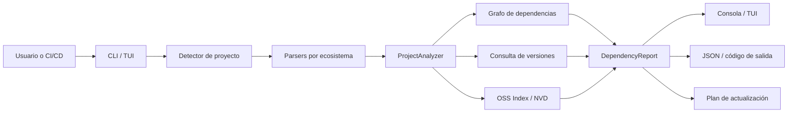

**UNIVERSIDAD PRIVADA DE TACNA**

**FACULTAD DE INGENIERÍA**

**Escuela Profesional de Ingeniería de Sistemas**

**Informe Final de Proyecto**

**Sistema Analizador de Dependencias Multi-Lenguaje (DepAnalyzer)**

Curso: *Calidad y Pruebas de Software*

Docente: *Patrick Cuadros Quiroga*

Integrantes:

***Carbajal Vargas, Andre Alejandro (2023077287)***

***Yupa Gómez, Fátima Sofía (2023076618)***

**Tacna - Perú**

***2026***

\pagebreak

Sistema *Analizador de Dependencias Multi-Lenguaje (DepAnalyzer)*

Informe Final de Proyecto

Versión *1.2*

| CONTROL DE VERSIONES |           |              |               |            |                                      |
|:--------------------:|:----------|:-------------|:--------------|:-----------|:-------------------------------------|
|       Versión        | Hecha por | Revisada por | Aprobada por  | Fecha      | Motivo                               |
|         1.0          | ACV, FYG  | ACV, FYG     | P. Cuadros Q. | 2026-06-22 | Versión final del informe de proyecto |
|         1.1          | ACV, FYG  | ACV, FYG     | P. Cuadros Q. | 2026-06-23 | Ampliación técnica, metodológica y de evidencias |
|         1.2          | ACV, FYG  | ACV, FYG     | P. Cuadros Q. | 2026-06-23 | Unificación del formato institucional |

# ÍNDICE GENERAL

1. [Antecedentes](#antecedentes)
2. [Planteamiento del Problema](#planteamiento-del-problema)
    1. [Problema](#problema)
    2. [Justificación](#justificación)
    3. [Alcance](#alcance)
3. [Objetivos](#objetivos)
    1. [Objetivo General](#objetivo-general)
    2. [Objetivos Específicos](#objetivos-específicos)
4. [Marco Teórico](#marco-teórico)
5. [Desarrollo de la Solución](#desarrollo-de-la-solución)
    1. [Análisis de Factibilidad](#análisis-de-factibilidad)
    2. [Tecnología de Desarrollo](#tecnología-de-desarrollo)
    3. [Metodología de Implementación](#metodología-de-implementación)
    4. [Módulos Implementados](#módulos-implementados)
    5. [Arquitectura y Flujo de Análisis](#arquitectura-y-flujo-de-análisis)
    6. [Trazabilidad de Requerimientos](#trazabilidad-de-requerimientos)
    7. [Decisiones de Seguridad](#decisiones-de-seguridad)
6. [Cronograma](#cronograma)
7. [Presupuesto](#presupuesto)
8. [Evidencias de Calidad](#evidencias-de-calidad)
9. [Resultados y Discusión](#resultados-y-discusión)
10. [Gestión de Riesgos](#gestión-de-riesgos)
11. [Conclusiones](#conclusiones)
12. [Recomendaciones](#recomendaciones)
13. [Anexos](#anexos)

\pagebreak

# Antecedentes

Los proyectos modernos dependen de bibliotecas de terceros para acelerar el desarrollo, reducir esfuerzo repetitivo y
aprovechar soluciones mantenidas por comunidades técnicas. Sin embargo, esta dependencia introduce riesgos de seguridad,
mantenibilidad y compatibilidad cuando las versiones quedan desactualizadas o cuando componentes transitivos incorporan
vulnerabilidades conocidas.

En entornos académicos y de desarrollo, la revisión manual de dependencias suele ser lenta, incompleta y difícil de
repetir. Los equipos deben revisar archivos Maven, Gradle, npm o Python, consultar fuentes externas de vulnerabilidades,
verificar versiones recientes y consolidar evidencia para reportes de calidad. Esta dispersión dificulta tener una visión
confiable del estado real del proyecto.

Frente a esta problemática, se implementó **DepAnalyzer**, una herramienta CLI/TUI desarrollada en Kotlin que automatiza
el análisis de dependencias multi-ecosistema, detecta versiones desactualizadas, consulta CVEs mediante OSS Index y NVD,
y publica evidencias de calidad en GitHub Pages para facilitar evaluación y trazabilidad.

La iniciativa se ubica dentro de las prácticas de **Software Composition Analysis (SCA)** y seguridad de la cadena de
suministro de software. A diferencia de una revisión centrada únicamente en el código escrito por el equipo, este enfoque
considera que una aplicación también hereda las propiedades, defectos y riesgos de los componentes externos que incorpora.
Por ello, conocer qué bibliotecas se utilizan, qué versión está instalada, cómo llegaron al proyecto y qué
vulnerabilidades conocidas las afectan constituye una actividad esencial de aseguramiento de calidad.

Antes de DepAnalyzer, el proceso equivalente requería combinar comandos propios de Maven, Gradle, npm o Poetry con
consultas manuales a repositorios y bases de vulnerabilidades. Los resultados debían interpretarse y reorganizarse para
distinguir dependencias directas de transitivas. La propuesta consolida estas actividades en un flujo reproducible,
orientado tanto al uso interactivo por parte de un desarrollador como a la ejecución automatizada dentro de integración
continua.

## Situación Actual y Oportunidad de Mejora

La proliferación de administradores de paquetes ha creado un entorno heterogéneo. Dos proyectos pueden resolver el mismo
problema técnico, pero declarar dependencias con sintaxis y archivos completamente distintos. Además, la información de
versiones y vulnerabilidades cambia continuamente. Esto genera una oportunidad para disponer de una capa común que
normalice las dependencias y produzca un diagnóstico homogéneo sin obligar al usuario a dominar cada herramienta por
separado.

DepAnalyzer aprovecha esta oportunidad mediante un modelo interno común, parsers especializados por ecosistema y clientes
desacoplados para fuentes externas. El resultado no pretende reemplazar las herramientas nativas, sino coordinarlas y
presentar sus datos con criterios consistentes de calidad, seguridad y trazabilidad.

# Planteamiento del Problema

## Problema

Los equipos de desarrollo necesitan controlar el riesgo asociado a dependencias externas, pero suelen enfrentar tres
limitaciones principales:

1. Los archivos de configuración varían según ecosistema: `pom.xml`, `build.gradle`, `build.gradle.kts`,
   `package.json`, `pyproject.toml` o `requirements.txt`.
2. Las vulnerabilidades pueden encontrarse en dependencias directas o transitivas, por lo que no siempre son visibles en
   el archivo principal del proyecto.
3. La evidencia de pruebas y análisis de calidad se genera en herramientas separadas, lo que dificulta presentarla de
   manera ordenada ante un evaluador.

Como resultado, el diagnóstico de seguridad y actualización de dependencias puede depender de búsquedas manuales,
criterio individual o reportes aislados sin trazabilidad suficiente.

### Formulación del Problema

¿Cómo automatizar, desde una única herramienta ejecutable en terminal, la detección de dependencias desactualizadas y
vulnerables en proyectos de distintos ecosistemas, conservando trazabilidad sobre el origen del hallazgo y generando
evidencia reutilizable en procesos de calidad y CI/CD?

### Causas y Efectos

| Causa identificada | Efecto sobre el proyecto |
|--------------------|--------------------------|
| Diversidad de formatos de construcción y manifiestos | Mayor esfuerzo para inspeccionar proyectos heterogéneos. |
| Dependencias transitivas no visibles en el manifiesto principal | Riesgos incorporados indirectamente pueden pasar desapercibidos. |
| Información distribuida entre repositorios, OSS Index y NVD | Diagnósticos lentos y con resultados difíciles de contrastar. |
| Ausencia de una salida normalizada | Dificultad para integrar el análisis en scripts y pipelines. |
| Actualizaciones manuales sin planificación ni respaldo | Posibilidad de introducir incompatibilidades o perder configuraciones. |
| Reportes de pruebas almacenados por separado | Menor trazabilidad durante revisiones técnicas y académicas. |

El problema central no es únicamente encontrar una versión nueva. Una actualización debe relacionarse con la versión
declarada, el ecosistema, la severidad del riesgo, la ubicación dentro del archivo, la cadena de dependencias y el efecto
esperado del cambio. Sin esta información, una recomendación automática puede resultar incompleta o incluso perjudicial.

## Justificación

La implementación de DepAnalyzer se justifica por la necesidad de contar con una herramienta local, automatizable y
documentada que permita revisar el estado de dependencias en proyectos de software. El sistema aporta valor académico y
técnico porque:

- Reduce el tiempo de diagnóstico de dependencias vulnerables o desactualizadas.
- Integra consultas a OSS Index y NVD para obtener información de CVEs.
- Produce reportes legibles y salida JSON para integración con CI/CD.
- Incluye una interfaz TUI para exploración interactiva desde terminal.
- Centraliza documentos FD y reportes de calidad en GitHub Pages.

La justificación también se analiza desde las siguientes perspectivas:

| Perspectiva | Aporte del proyecto |
|-------------|---------------------|
| Académica | Aplica requerimientos, arquitectura, pruebas, seguridad y automatización sobre un producto funcional. |
| Técnica | Unifica varios ecosistemas mediante interfaces y modelos comunes, manteniendo parsers especializados. |
| Operativa | Reduce pasos manuales y ofrece comandos aptos para uso local o CI/CD. |
| Seguridad | Facilita identificar componentes con CVE y priorizarlos por severidad y cadena de introducción. |
| Calidad | Publica resultados repetibles de pruebas y análisis estático junto con la documentación. |
| Económica | Utiliza tecnologías open-source y servicios gratuitos adecuados al contexto académico. |

Los beneficiarios directos son desarrolladores, responsables de calidad y equipos académicos que necesitan evaluar
proyectos con dependencias externas. De forma indirecta, también se benefician usuarios finales, pues una gestión más
temprana de componentes vulnerables disminuye la probabilidad de que fallos conocidos lleguen a producción.

## Alcance

El alcance comprende análisis, diseño, construcción, pruebas, documentación y publicación de evidencias del sistema
DepAnalyzer. La solución incluye:

- Soporte para Maven, Gradle Groovy, Gradle Kotlin, npm, Poetry y `requirements.txt`.
- Comandos CLI `analyze`, `tui` y `update`.
- Consulta de vulnerabilidades con OSS Index, NVD o modo automático.
- Clasificación de vulnerabilidades directas y transitivas.
- Exportación JSON para integración con pipelines.
- Actualización guiada de dependencias con confirmación y backup.
- Servidor MCP para integración con agentes compatibles.
- Publicación de documentación y reportes en GitHub Pages.

No se incluye una interfaz web dedicada, una aplicación móvil, remediación automática sin confirmación ni sustitución
completa de plataformas SCA empresariales.

### Entregables Comprendidos

- Aplicación Kotlin ejecutable como distribución JVM y preparada para compilación nativa.
- Parsers estáticos y mecanismos de resolución dinámica para los ecosistemas soportados.
- Reportes por consola, árbol de dependencias y documento JSON apto para automatización.
- Flujo de actualización con plan, simulación, selección, aplicación y respaldo.
- Suite de pruebas automatizadas y configuración de herramientas de análisis.
- Servidor MCP para exponer operaciones controladas a clientes compatibles.
- Documentos FD01, FD02, FD03, FD04 y FD05, diccionario de datos y estándar de programación.
- Sitio GitHub Pages con documentos, evidencias de calidad y documentación Dokka.

### Restricciones y Supuestos

- Las consultas de vulnerabilidades y versiones requieren conectividad, salvo el análisis estructural en modo offline.
- OSS Index y NVD pueden aplicar límites de uso; los tokens mejoran la capacidad, pero deben permanecer secretos.
- La exactitud del árbol dinámico depende de que Maven o Gradle puedan resolver correctamente el proyecto analizado.
- Una versión más reciente no garantiza compatibilidad semántica; por ello la actualización final requiere decisión del
  usuario.
- El análisis se limita a los formatos implementados y no inspecciona código binario ni comportamiento en tiempo de
  ejecución.

# Objetivos

## Objetivo General

Implementar una herramienta CLI/TUI multi-ecosistema que permita analizar dependencias de proyectos de software,
identificar versiones desactualizadas, detectar vulnerabilidades CVE y generar evidencia técnica verificable para
procesos de calidad y pruebas.

## Objetivos Específicos

- Desarrollar parsers para archivos Maven, Gradle, npm y Python.
- Implementar consulta de vulnerabilidades mediante OSS Index y NVD.
- Clasificar hallazgos por severidad, dependencia directa y dependencia transitiva.
- Generar reportes por consola y JSON para uso humano y automatizado.
- Implementar actualización guiada con simulación, confirmación y backup.
- Validar el sistema con pruebas unitarias, integración, interfaz, mutación y análisis estático.
- Publicar documentación y reportes de evidencia mediante GitHub Pages.

### Indicadores de Cumplimiento

| Objetivo específico | Indicador verificable | Evidencia |
|---------------------|-----------------------|-----------|
| Soportar múltiples ecosistemas | Detección y parseo de Maven, Gradle, npm y Python | Parsers y pruebas por formato |
| Consultar vulnerabilidades | Integración funcional con OSS Index y NVD | Clientes HTTP y pruebas con respuestas simuladas |
| Diferenciar origen del riesgo | Clasificación directa/transitiva y visualización de cadenas | Grafo, reporte y árbol de dependencias |
| Permitir automatización | JSON válido y códigos de salida configurables | `--output json`, `--quiet`, `--fail-on-critical` |
| Reducir riesgo al actualizar | Simulación, plan identificable, selección y backup | Comando `update` y actualizadores por formato |
| Asegurar calidad | Ejecución repetible de pruebas y análisis | Gradle, PIT, Semgrep, Snyk y Sonar |
| Facilitar revisión | Documentación accesible desde una URL pública | Workflow y sitio GitHub Pages |

# Marco Teórico

**Análisis de Composición de Software (SCA).** El SCA permite identificar componentes de terceros, evaluar su estado de
actualización y detectar vulnerabilidades conocidas. Es una práctica clave en seguridad de software moderno.

**CVE y CVSS.** CVE es un identificador estándar para vulnerabilidades conocidas. CVSS permite expresar severidad mediante
puntajes y categorías como `LOW`, `MEDIUM`, `HIGH` y `CRITICAL`.

**Dependencias transitivas.** Una dependencia transitiva es incorporada indirectamente por otra dependencia directa. Su
análisis es importante porque puede introducir riesgos aunque no aparezca declarada explícitamente en el archivo build.

**CLI/TUI.** Una CLI permite automatización mediante comandos y scripts. Una TUI agrega interacción visual en terminal sin
requerir interfaz gráfica web o de escritorio.

**GitHub Actions y GitHub Pages.** GitHub Actions automatiza pruebas, análisis y generación de artefactos. GitHub Pages
permite publicar documentación estática y reportes de evidencia accesibles desde un enlace público.

## Gestión de Dependencias

Una dependencia directa es aquella declarada explícitamente por el proyecto. Una dependencia transitiva es incorporada
por otra biblioteca durante la resolución. Esta diferencia es relevante para la remediación: una dependencia directa
puede actualizarse en el manifiesto principal, mientras que una transitiva puede exigir actualizar su componente padre,
aplicar una restricción o excluir una versión.

Los ecosistemas utilizan identificadores distintos. Maven y Gradle suelen representar un componente mediante
`group:artifact:version`; npm utiliza el nombre del paquete y su versión; PyPI identifica distribuciones Python. Para
consultar servicios externos, estos datos se transforman en coordenadas Package URL (PURL), lo que proporciona una
representación interoperable.

## Vulnerabilidades, CVE y Priorización

Una vulnerabilidad conocida puede estar asociada a uno o varios identificadores CVE, referencias técnicas, descripciones
y puntajes CVSS. DepAnalyzer normaliza los hallazgos en categorías `LOW`, `MEDIUM`, `HIGH` y `CRITICAL`. La severidad es un
criterio de priorización, pero debe interpretarse junto con la ubicación del componente, su exposición y la existencia de
una versión corregida.

La consulta principal se realiza mediante Sonatype OSS Index, que acepta componentes de varios ecosistemas. Para Maven,
NVD puede actuar como fuente alternativa o complementaria. El sistema mantiene separada la fuente del hallazgo para que
el reporte no pierda procedencia y aplica degradación controlada cuando una fuente no está disponible.

## Grafos y Cadenas de Dependencia

El conjunto de componentes se modela como un grafo dirigido. Cada nodo representa una dependencia y cada arista expresa
que un componente requiere a otro. Este modelo permite reconstruir la ruta desde una dependencia declarada hasta un
componente vulnerable y responder no solo **qué** biblioteca presenta riesgo, sino también **por qué** forma parte del
proyecto.

## Calidad de Software

La calidad se aborda como una combinación de corrección funcional y atributos no funcionales:

- **Confiabilidad:** manejo de fallos parciales de red y datos incompletos.
- **Mantenibilidad:** separación en módulos, tipos explícitos y pruebas automatizadas.
- **Portabilidad:** ejecución sobre JVM y preparación para distribución nativa.
- **Usabilidad técnica:** ayuda integrada, opciones consistentes y TUI.
- **Seguridad:** protección de tokens y restricción de credenciales por host y protocolo.
- **Interoperabilidad:** salida JSON y servidor MCP.
- **Auditabilidad:** evidencias publicadas y relacionadas con documentos de arquitectura.

## Pruebas de Software

Las pruebas unitarias verifican parsers, modelos, planificadores, renderizado y reglas aisladas. Las pruebas de integración
validan la colaboración entre componentes y clientes HTTP usando servidores simulados. Las pruebas de interfaz revisan el
comportamiento observable de la CLI/TUI, mientras que las pruebas de mutación estiman la capacidad de la suite para
detectar modificaciones artificiales en la lógica. Semgrep, Snyk y Sonar complementan la estrategia con análisis estático,
dependencias vulnerables y métricas de calidad.

## Integración Continua y Documentación Viva

La integración continua transforma cada cambio en una oportunidad de verificación. El workflow compila, ejecuta pruebas,
genera documentación y reúne reportes dentro de un sitio estático. De este modo, la documentación deja de ser un archivo
aislado y pasa a estar vinculada con evidencia producida desde la misma versión del código.

# Desarrollo de la Solución

## Análisis de Factibilidad

### Factibilidad Técnica

El proyecto es técnicamente factible. Kotlin, Gradle, Clikt, OkHttp, Jackson y JUnit 5 son tecnologías maduras y
adecuadas para una herramienta CLI/TUI. El equipo cuenta con repositorio GitHub, workflows de CI y estructura modular
para evolucionar parsers, reportes y clientes externos.

### Factibilidad Económica

La inversión directa es baja porque el proyecto utiliza herramientas open-source y servicios gratuitos para el contexto
académico. Los costos se concentran en tiempo de desarrollo, conectividad, ejecución de pipelines y configuración de
reportes.

| Componente de Inversión | Tipo | Monto |
|-------------------------|------|-------|
| Costos de personal del equipo | Personal | S/ 5,000.00 |
| Costos generales (conectividad, energía, útiles) | Generales | S/ 250.00 |
| Costos del ambiente (GitHub, CI/CD, publicación) | Infraestructura | S/ 0.00 |
| Tokens/API keys para pruebas controladas | Operación | S/ 0.00 |
| **INVERSIÓN TOTAL ESTIMADA** |  | **S/ 5,250.00** |

### Factibilidad Operativa

La herramienta se ejecuta desde terminal y se integra con workflows de CI/CD, por lo que su adopción no requiere
infraestructura compleja. La publicación de evidencia en GitHub Pages facilita la revisión docente.

### Factibilidad Legal

El sistema usa bibliotecas open-source y APIs públicas respetando sus términos de uso. Los tokens se gestionan mediante
variables de entorno y secretos de GitHub, evitando exposición de credenciales.

### Factibilidad Social y Ambiental

El proyecto fortalece prácticas de seguridad y calidad en estudiantes de ingeniería. Además, reduce uso de documentos
físicos al centralizar evidencia en repositorio y GitHub Pages.

## Tecnología de Desarrollo

| Capa | Tecnología | Propósito |
|------|------------|-----------|
| Lenguaje | Kotlin JVM | Implementación principal de la CLI/TUI. |
| Build | Gradle Kotlin DSL | Compilación, pruebas, empaquetado y plugins de calidad. |
| CLI | Clikt / Mordant | Definición de comandos y salida visual en consola. |
| HTTP | OkHttp | Comunicación con OSS Index, NVD y repositorios. |
| JSON/XML | Jackson / Maven Model | Serialización, parseo XML y reportes JSON. |
| Pruebas | JUnit 5, MockK, MockWebServer | Validación unitaria, integración y clientes HTTP. |
| Calidad | Semgrep, Snyk, Sonar, PIT | Análisis estático, seguridad y pruebas de mutación. |
| Documentación | Markdown, Dokka, GitHub Pages | Documentos FD, API docs y reportes publicados. |
| Integración | GitHub Actions, MCP | CI/CD y automatización compatible con agentes. |

## Metodología de Implementación

Se aplicó una metodología incremental orientada a evidencia, tomando como base los documentos FD01-FD04 y validando cada
módulo mediante pruebas automatizadas.

| Fase | Actividades Principales | Producto Esperado |
|------|-------------------------|-------------------|
| Concepción | Definición del problema, alcance, riesgos y factibilidad. | FD01 y FD02 alineados al proyecto. |
| Elaboración | Requerimientos, arquitectura, módulos y criterios de calidad. | FD03, FD04 y backlog técnico. |
| Construcción | Implementación CLI/TUI, parsers, clientes externos, reportes y update. | Incrementos funcionales probados. |
| Transición | Publicación de documentación, reportes y validación final. | GitHub Pages, FD05 y evidencias de calidad. |

El trabajo se organizó en incrementos funcionales pequeños. Cada incremento debía conservar compilación, pruebas y una
interfaz coherente. Esta estrategia fue especialmente importante al ampliar el soporte desde Maven/Gradle hacia npm y
Python, porque permitió reutilizar el modelo central sin mezclar reglas de sintaxis entre ecosistemas.

### Ciclo de Desarrollo Aplicado

1. Identificar una capacidad o riesgo pendiente.
2. Precisar su comportamiento esperado y casos límite.
3. Implementar o adaptar el módulo responsable.
4. Agregar pruebas sobre escenarios válidos, inválidos y fallos externos.
5. Ejecutar la suite y revisar el resultado observable de la CLI.
6. Actualizar documentación y trazabilidad.
7. Integrar el cambio al repositorio para su validación en CI.

## Módulos Implementados

| Módulo | Descripción | Evidencia |
|--------|-------------|-----------|
| CLI | Comandos `analyze`, `tui`, `update` y flags de ejecución. | `src/main/kotlin/com/depanalyzer/cli` |
| Core | Orquestación de detección, parseo, consulta y reporte. | `src/main/kotlin/com/depanalyzer/core` |
| Parser | Lectura de Maven, Gradle, npm y Python. | `src/main/kotlin/com/depanalyzer/parser` |
| Repository | Clientes OSS Index, NVD y repositorios de versiones. | `src/main/kotlin/com/depanalyzer/repository` |
| Report | Modelos de reporte, JSON y renderizado de consola. | `src/main/kotlin/com/depanalyzer/report` |
| Update | Planificación y aplicación segura de actualizaciones. | `src/main/kotlin/com/depanalyzer/update` |
| TUI | Interfaz interactiva de terminal. | `src/main/kotlin/com/depanalyzer/tui` |
| MCP | Servidor para integración con agentes. | `integrations/mcp` |

### Responsabilidades Detalladas

**CLI y TUI.** La capa de interacción interpreta opciones, valida combinaciones y presenta el resultado. `analyze` cubre el
flujo de diagnóstico, `tui` ofrece navegación interactiva y `update` administra la remediación. Esta capa no implementa
reglas de parseo ni acceso directo a fuentes externas.

**Core.** `ProjectAnalyzer` coordina detección, lectura de dependencias, resolución de versiones, consulta de
vulnerabilidades y generación del reporte. Su función es componer servicios manteniendo separadas sus responsabilidades.

**Parser.** Cada parser traduce un formato específico hacia `ParsedDependency`. Los parsers de lockfiles aportan versiones
resueltas y relaciones transitivas; los parsers de manifiestos conservan información de declaración y ubicación.

**Repository.** Encapsula la comunicación HTTP, autenticación, reintentos, límites y transformación de respuestas. La
aplicación puede seleccionar OSS Index, NVD o una política automática sin trasladar estos detalles al resto del sistema.

**Report y grafo.** Consolidan los resultados en `DependencyReport`, construyen árboles y cadenas, clasifican severidades y
producen representaciones para personas o máquinas.

**Update.** Convierte el diagnóstico en sugerencias accionables. Los actualizadores conocen la sintaxis de cada archivo y
modifican únicamente la ubicación aprobada, previa generación de respaldo.

## Arquitectura y Flujo de Análisis

La arquitectura sigue una organización por capas y puertos especializados. Las dependencias del código apuntan desde la
interfaz hacia el núcleo y desde este hacia abstracciones o servicios concretos delimitados. Esta separación reduce el
impacto de agregar un nuevo parser, fuente de vulnerabilidades o formato de salida.

### Secuencia Principal

1. El usuario indica una ruta y opciones de análisis.
2. `ProjectDetector` identifica los manifiestos y lockfiles disponibles.
3. El parser correspondiente extrae dependencias, versiones, secciones y ubicaciones.
4. Cuando el modo dinámico está habilitado, Maven o Gradle aportan el árbol resuelto.
5. El núcleo consulta versiones recientes y transforma componentes a coordenadas compatibles con las fuentes SCA.
6. OSS Index o NVD devuelven vulnerabilidades que se normalizan y asocian con dependencias.
7. El grafo reconstruye cadenas directas y transitivas.
8. El generador produce un `DependencyReport`.
9. La salida se renderiza en consola/TUI o se serializa como JSON.
10. Opcionalmente, el usuario genera o aplica un plan de actualización.

### Modos de Operación

| Modo | Comportamiento | Uso recomendado |
|------|----------------|-----------------|
| Estático / offline | Lee manifiestos sin ejecutar herramientas externas | Diagnóstico rápido o entorno sin red |
| Dinámico | Ejecuta resolución Maven/Gradle para obtener árbol real | Mayor precisión en proyectos JVM |
| Automático de vulnerabilidades | Prioriza OSS Index y aplica fallback permitido | Uso general |
| OSS forzado | Consulta solo OSS Index | Comparación o política específica |
| NVD forzado | Consulta solo NVD | Validación enfocada en datos NVD |
| JSON silencioso | Emite datos sin ruido de consola | Scripts, MCP y CI/CD |

## Trazabilidad de Requerimientos

La trazabilidad relaciona necesidad, implementación y validación. Esto reduce el riesgo de declarar funcionalidades sin
evidencia o mantener pruebas desconectadas del propósito del sistema.

| Requerimiento | Implementación principal | Validación esperada |
|---------------|--------------------------|---------------------|
| RF-01 Detectar proyecto | `ProjectDetector` y `ProjectType` | Fixtures con distintos manifiestos |
| RF-02 Parsear Maven/Gradle | Parsers POM, Groovy y Kotlin DSL | Pruebas de sintaxis, catálogos y propiedades |
| RF-04 Consultar versiones | `RepositoryClient` | Respuestas válidas, vacías y errores HTTP |
| RF-05/RF-06 Detectar CVE | `OssIndexClient`, `NvdClient` | MockWebServer, autenticación y normalización |
| RF-07 Clasificar cadenas | Grafo y `VulnerabilityChain` | Casos directos, transitivos y duplicados |
| RF-08 Mostrar resultados | `ConsoleRenderer` y árbol | Salida con profundidad, expansión y ASCII |
| RF-09 Exportar JSON | `ReportGenerator` | JSON parseable sin contaminación de stdout |
| RF-10 TUI | `AnalyzeTuiApp` y estado TUI | Navegación, filtros y terminal limitada |
| RF-11 a RF-13 Actualizar | Planner, comando y updaters | Plan, dry-run, backup y aplicación selectiva |
| RF-14 Fallar por críticos | CLI y códigos de salida | Ejecución con/sin hallazgos críticos |
| RNF-04 Seguridad | Allowlist de hosts y secretos de entorno | No envío por HTTP ni a hosts no confiables |
| RNF-05 Interoperabilidad | JSON y MCP | Consumo automatizado y pruebas MCP |
| RNF-07 Mantenibilidad | Paquetes y contratos tipados | Suite automatizada y documentación Dokka |
| RNF-08 Auditabilidad | Workflows y Pages | Reportes publicados por versión |

## Decisiones de Seguridad

La herramienta procesa credenciales y datos obtenidos desde Internet, por lo que se adoptaron controles específicos:

- Los tokens se reciben por variable de entorno o parámetro explícito y no se almacenan en archivos del proyecto.
- Las credenciales de repositorios solo pueden enviarse por HTTPS.
- `DEPANALYZER_TRUSTED_CREDENTIAL_HOSTS` funciona como allowlist; sin configuración, el comportamiento es restrictivo.
- Los clientes externos usan timeouts y manejo de errores para evitar bloqueos indefinidos.
- La salida JSON evita incluir secretos y puede enviarse a `stdout` de forma limpia.
- La actualización de archivos requiere aprobación o identificador de plan y genera respaldo antes de escribir.
- Los análisis de Semgrep, Snyk y Sonar se ejecutan como controles complementarios en CI.

Estas decisiones aplican los principios de mínimo privilegio, denegación por defecto, separación de responsabilidades y
trazabilidad de acciones.

# Cronograma

El proyecto se desarrolló durante la Unidad 2 del curso, con cierre documental y publicación de evidencias en junio de
2026.

| Actividad / Fase | Sem. 1-2 | Sem. 3-4 | Sem. 5-6 | Sem. 7-8 | Sem. 9-10 |
|------------------|:--------:|:--------:|:--------:|:--------:|:---------:|
| Levantamiento, alcance y factibilidad | X |  |  |  |  |
| Visión, requerimientos y arquitectura | X | X |  |  |  |
| Implementación de parsers y análisis |  | X | X |  |  |
| Reportes, TUI y actualización guiada |  |  | X | X |  |
| Pruebas, calidad y documentación |  |  |  | X | X |
| Publicación GitHub Pages y cierre FD05 |  |  |  |  | X |

## Hitos y Productos

| Hito | Producto verificable | Criterio de cierre |
|------|----------------------|--------------------|
| H1 Definición | FD01, FD02 y alcance acordado | Problema, actores y factibilidad identificados |
| H2 Especificación | FD03 y requerimientos priorizados | Requerimientos con criterio y trazabilidad |
| H3 Arquitectura | FD04 y estructura modular | Vistas 4+1 y atributos de calidad documentados |
| H4 Producto mínimo | Detección, parseo y reporte base | Análisis funcional sobre proyectos JVM |
| H5 Ampliación | npm, Python, TUI, update y MCP | Flujos adicionales integrados al núcleo |
| H6 Calidad | Suite y herramientas automatizadas | Reportes generables desde CI |
| H7 Entrega | FD05 y GitHub Pages | Documentos y evidencias accesibles |

# Presupuesto

## Inversión de Desarrollo

| Componente de Inversión | Monto |
|-------------------------|-------|
| Costos de personal del equipo de desarrollo | S/ 5,000.00 |
| Costos generales (conectividad, energía eléctrica y útiles) | S/ 250.00 |
| Costos del ambiente (GitHub Actions, GitHub Pages, herramientas open-source) | S/ 0.00 |
| **INVERSIÓN TOTAL DE DESARROLLO** | **S/ 5,250.00** |

### Criterio de Estimación

El costo de personal representa horas académicas de análisis, diseño, implementación, pruebas y documentación valorizadas
como esfuerzo profesional referencial. No corresponde a un desembolso salarial real del curso, pero permite comparar el
esfuerzo invertido con los beneficios obtenidos. La infraestructura se considera sin costo directo porque el repositorio,
Actions y Pages se utilizan dentro de sus niveles gratuitos.

## Evaluación Financiera

| Indicador | Resultado e Interpretación |
|-----------|----------------------------|
| VAN | Positivo en términos académicos por ahorro de tiempo de revisión y reducción de riesgo técnico. |
| TIR | Favorable al no requerir licencias comerciales obligatorias. |
| B/C | Mayor a 1 al centralizar análisis, reportes y documentación en una solución automatizable. |

### Beneficios Cuantificables y No Cuantificables

| Beneficio | Tipo | Forma de observación |
|-----------|------|----------------------|
| Reducción de pasos manuales | Cuantificable | Menos comandos y consultas separadas por análisis |
| Reutilización en CI/CD | Cuantificable | Ejecución repetible sin intervención |
| Detección temprana de riesgo | Cuantificable | Hallazgos antes de liberación |
| Mayor trazabilidad | No cuantificable directamente | Relación entre dependencia, CVE, cadena y evidencia |
| Aprendizaje técnico del equipo | No cuantificable directamente | Aplicación integrada de arquitectura, pruebas y seguridad |
| Mejor capacidad de auditoría | No cuantificable directamente | Reportes disponibles desde una URL común |

# Evidencias de Calidad

Las evidencias se publican desde GitHub Pages:

- [Reportes de pruebas y calidad](./reports/)
- [Documentación autogenerada de la aplicación](./api-docs/)
- [FD04 - Arquitectura con enlaces de evidencia](./FD04-EPIS-Informe%20Arquitectura%20de%20Software.html)

Reportes considerados:

- Sonar
- Semgrep
- Snyk
- Pruebas unitarias
- Pruebas de integración
- Pruebas de mutación
- Pruebas de interfaz
- Pruebas BDD
- Documentación Dokka

## Estrategia de Verificación

La verificación combina diferentes niveles para evitar depender de una sola clase de prueba:

| Nivel | Propósito | Herramientas / Evidencia |
|-------|-----------|--------------------------|
| Compilación | Detectar errores de tipos, dependencias y empaquetado | Gradle `assemble` |
| Unitaria | Verificar reglas y transformaciones aisladas | JUnit 5 y Kotlin Test |
| Integración | Validar clientes HTTP, parsers y colaboración de módulos | MockWebServer y fixtures |
| Interfaz | Confirmar opciones, salida, códigos y comportamiento TUI | Pruebas de comandos y estado |
| Mutación | Medir si las pruebas detectan cambios lógicos artificiales | PIT |
| Estática | Identificar patrones riesgosos y deuda técnica | Semgrep y Sonar |
| Dependencias | Revisar vulnerabilidades de componentes del propio proyecto | Snyk |
| Integración externa | Validar el servidor para agentes | Suite npm de `integrations/mcp` |

Al momento de esta ampliación, el repositorio contiene **43 archivos de prueba Kotlin** y **292 métodos anotados con
`@Test`**. Estas cifras describen el inventario del código y no sustituyen métricas como cobertura o mutation score, que
deben consultarse en los reportes generados por CI.

## Criterios de Aceptación de la Entrega

- El proyecto compila y la suite principal se ejecuta sin fallos.
- Los documentos existentes permanecen versionados y navegables.
- FD04 y FD05 enlazan las evidencias solicitadas.
- La salida JSON se mantiene válida para consumo automatizado.
- Los reportes disponibles se copian a rutas estables del sitio.
- La ausencia de tokens Sonar o Snyk no impide publicar la documentación básica.
- La documentación Dokka se publica cuando la tarea puede resolver sus dependencias.

# Resultados y Discusión

## Resultados Funcionales

El producto obtenido supera el alcance inicial centrado en Maven y Gradle. La arquitectura permitió incorporar npm,
Poetry y `requirements.txt` conservando un flujo común de análisis. Además del diagnóstico por consola, se implementaron
una TUI, salida JSON, selección de fuentes de vulnerabilidad, visualización de cadenas y actualización asistida.

La aplicación puede operar como herramienta de escritorio técnico, componente de pipeline o servicio expuesto mediante
MCP. Esta variedad confirma que el núcleo no está acoplado a una única interfaz. El mismo reporte puede alimentar
renderizado humano, decisiones de CI o planes de actualización.

## Resultados de Ingeniería

| Aspecto | Resultado alcanzado |
|---------|---------------------|
| Modularidad | 77 archivos Kotlin principales organizados por responsabilidad |
| Pruebas | 43 archivos de prueba y 292 métodos `@Test` inventariados |
| Ecosistemas | Maven, Gradle Groovy/Kotlin, npm, Poetry y requirements |
| Fuentes de vulnerabilidad | OSS Index y NVD con selección explícita o automática |
| Interfaces | CLI, TUI, JSON y MCP |
| Remediación | Plan, dry-run, aplicación selectiva y backup |
| Publicación | Workflow para documentos, reportes y API docs |

## Discusión

El principal aporte no es la cantidad de formatos soportados, sino la normalización. Cada ecosistema conserva
particularidades que no deben ocultarse; sin embargo, el usuario necesita comparar resultados mediante conceptos comunes:
componente, versión actual, versión reciente, vulnerabilidad, severidad y cadena. El modelo interno permite esta
comparación sin reducir toda la información a texto libre.

También se comprobó que la precisión y la disponibilidad mantienen una relación de compromiso. El análisis estático es
rápido y robusto, pero puede no reconstruir todas las dependencias transitivas. El análisis dinámico ofrece mayor
fidelidad, aunque depende de herramientas instaladas, red y configuración válida. Por esta razón se conservaron ambos
modos y se permite que el usuario elija según el contexto.

Otro resultado relevante es la necesidad de tratar la remediación como un proceso supervisado. Actualizar
automáticamente a la versión más reciente podría introducir cambios incompatibles. DepAnalyzer presenta información,
permite simular y exige una decisión antes de modificar el archivo, equilibrando automatización y control humano.

Finalmente, la publicación de reportes depende de servicios externos. Los secretos de SonarCloud y Snyk no forman parte
del repositorio, y tareas como Dokka pueden requerir acceso a repositorios de artefactos. El workflow se diseñó para
preservar la publicación documental incluso si una evidencia opcional no puede generarse, dejando visible el estado de
cada reporte.

# Gestión de Riesgos

| Riesgo | Probabilidad | Impacto | Respuesta |
|--------|--------------|---------|-----------|
| Límite o indisponibilidad de OSS Index/NVD | Media | Alta | Tokens, timeouts, reintentos, fallback y mensaje controlado |
| Cambio de formato en manifiestos o lockfiles | Media | Media | Parsers aislados, fixtures y pruebas de regresión |
| Falso sentido de seguridad por ausencia de hallazgos | Media | Alta | Informar fuente, modo y limitaciones; complementar herramientas |
| Actualización incompatible | Media | Alta | Dry-run, plan, selección, backup y confirmación |
| Exposición de credenciales | Baja | Crítica | Variables de entorno, secretos CI, HTTPS y allowlist |
| Duración excesiva de pruebas de mutación | Alta | Media | Timeout, ejecución separada y optimización gradual |
| Fallo de un servicio de calidad externo | Media | Media | `continue-on-error` para reportes opcionales y publicación base |
| Divergencia entre código y documentos | Media | Media | Documentación versionada y revisión en cada incremento |

Los riesgos no se consideran eliminados. Se administran mediante controles preventivos, detectivos y correctivos. La
tabla debe revisarse cuando se agregue un ecosistema, cambie una API o se amplíe la capacidad de escritura del sistema.

# Conclusiones

1. El análisis integral confirma que DepAnalyzer es viable técnica, económica y operativamente para el contexto académico.
   La solución utiliza tecnologías abiertas, puede ejecutarse en equipos de desarrollo comunes y no requiere
   infraestructura permanente.
2. Se logró automatizar un proceso que normalmente exige combinar herramientas y fuentes distintas. La detección del
   proyecto, el parseo, la consulta de versiones, la búsqueda de CVE y la generación del reporte forman un flujo único y
   repetible.
3. La abstracción por ecosistema demostró ser adecuada para ampliar el producto. Maven, Gradle, npm y Python conservan
   parsers propios, pero comparten modelos, análisis, severidades y salidas.
4. La representación mediante grafos mejora la utilidad del hallazgo al explicar la cadena por la que una vulnerabilidad
   transitiva ingresa al proyecto.
5. La salida JSON, los códigos de proceso y MCP permiten integrar DepAnalyzer en automatizaciones, mientras la consola y
   la TUI cubren el uso interactivo.
6. El proceso de actualización asistida reduce riesgos frente a una edición manual o una actualización totalmente
   automática, al incluir plan, simulación, selección y respaldo.
7. La estrategia de calidad combina pruebas funcionales, integración, interfaz, mutación y análisis estático. El
   inventario actual de pruebas refleja un esfuerzo significativo, aunque las métricas finales deben interpretarse desde
   los reportes de CI.
8. GitHub Pages centraliza los documentos FD, los reportes y la documentación del código, fortaleciendo la auditabilidad
   de la entrega.
9. La dependencia de APIs externas y secretos de terceros constituye una limitación real. El sistema la aborda mediante
   degradación controlada, selección de fuente y publicación documental independiente.
10. El proyecto permitió aplicar de manera integrada conceptos de arquitectura, seguridad de la cadena de suministro,
    pruebas automatizadas, CI/CD y documentación, cumpliendo el propósito formativo del curso.

# Recomendaciones

- Mantener actualizados los tokens `OSS_INDEX_TOKEN`, `NVD_API_KEY`, `SONAR_TOKEN` y `SNYK_TOKEN` como secretos de GitHub.
- Revisar periódicamente los reportes publicados en GitHub Pages después de cada push a `main`.
- Ampliar la cobertura de pruebas BDD con escenarios de usuario final para `analyze`, `tui` y `update`.
- Optimizar la duración de pruebas de mutación para que el reporte PIT complete dentro del tiempo del workflow.
- Mantener sincronizados README, FD03, FD04 y FD05 cuando se agreguen nuevos ecosistemas o comandos.
- Definir una línea base de cobertura y mutation score para evaluar tendencias entre versiones.
- Incorporar pruebas end-to-end sobre proyectos de ejemplo versionados para cada ecosistema.
- Separar formalmente suites unitarias, de integración y de interfaz en tareas Gradle diferentes para que sus reportes no
  reutilicen el mismo resultado.
- Publicar un Software Bill of Materials (SBOM) en CycloneDX o SPDX para complementar el reporte de análisis.
- Agregar caché con vencimiento para consultas de metadatos y vulnerabilidades, respetando la actualización de las fuentes.
- Firmar artefactos de release y documentar su verificación para fortalecer la cadena de suministro del propio
  DepAnalyzer.
- Mantener una política explícita de versiones soportadas para JDK, Maven, Gradle, Node.js y Python.

# Anexos

# Anexo 01 Informe de Factibilidad

Contiene el análisis integral de factibilidad técnica, económica, operativa, legal, social y ambiental del proyecto.

# Anexo 02 Documento de Visión

Define la visión general del sistema, interesados, usuarios, características del producto, restricciones y criterios de
calidad.

# Anexo 03 Documento SRS

Documenta los requerimientos funcionales, no funcionales, reglas de negocio, modelos conceptuales y trazabilidad técnica
del sistema.

# Anexo 04 Documento SAD

Describe la arquitectura bajo el modelo 4+1, las vistas lógicas, de implementación, procesos, despliegue y atributos de
calidad.

# Anexo 05 Manuales y otros documentos

Comprende README, diccionario de datos, estándar de programación, documentación autogenerada y reportes de pruebas
publicados en GitHub Pages.

# Anexo 06 Matriz de Entregables

| Entregable solicitado | Documento o ubicación |
|-----------------------|-----------------------|
| FD01 - Informe de Factibilidad | `FD01-Informe-Factibilidad.md` |
| FD02 - Informe de Visión de Producto | `FD02-Informe-Vision.md` |
| FD03 - Especificación de Requerimientos | `FD03-EPIS-Informe Especificación Requerimientos.md` |
| FD04 - Informe de Arquitectura | `FD04-EPIS-Informe Arquitectura de Software.md` |
| FD05 - Informe de Proyecto | Documento actual |
| Diccionario de Datos | `Diccionario-de-Datos.md` |
| Estándar de Programación | `Estandar-de-Programacion.md` |
| Reportes de calidad y pruebas | `reports/` en GitHub Pages |
| Documentación autogenerada | `api-docs/` en GitHub Pages |

# Anexo 07 Glosario

| Término | Definición |
|---------|------------|
| CVE | Identificador público de una vulnerabilidad conocida. |
| CVSS | Sistema de puntuación de severidad de vulnerabilidades. |
| SCA | Análisis de composición de software y componentes de terceros. |
| PURL | Formato estándar para identificar paquetes entre ecosistemas. |
| Dependencia directa | Componente declarado explícitamente por el proyecto. |
| Dependencia transitiva | Componente incorporado por otra dependencia. |
| Lockfile | Archivo que registra versiones resueltas para una instalación reproducible. |
| TUI | Interfaz de usuario presentada dentro de una terminal. |
| MCP | Protocolo para integrar herramientas y contexto con agentes compatibles. |
| CI/CD | Automatización de integración, verificación y entrega de cambios. |

# Anexo 08 Manual, Trazas y Videos de Interfaz

El manual se mantiene en `docs/Manual-de-Usuario.md` y se publica junto con la documentación técnica Dokka. Playwright
verifica portada, documentos FD, manual, índice de reportes y comportamiento responsive.

| Evidencia | Generación | Publicación |
|-----------|------------|-------------|
| Reporte HTML | `build/reports/playwright` | `reports/interface/` |
| Resultado JUnit | `build/test-results/interface/playwright.xml` | Artefacto Actions |
| Videos WebM | `build/test-results/playwright` | `reports/interface/videos/` |
| Capturas y trazas | `build/test-results/playwright` | Artefacto Actions |
| API técnica | `build/dokka/html` | `api-docs/` |

Así, el manual se relaciona con una navegación ejecutada y evidencia audiovisual producida por la misma revisión del
código.
